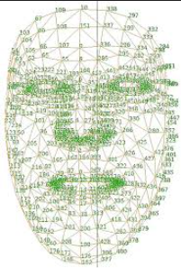

# 🧠 Face Emotion & Drowsiness Detector

> Gerçek zamanlı yüz analizi: duygu tanıma ve uyku uyarı sistemi  
> **MediaPipe FaceMesh · OpenCV · Python**

---

## 📸 Ekran Görüntüsü



*MediaPipe FaceMesh tarafından tespit edilen 468 yüz landmark noktası*

---

## 🧬 MediaPipe FaceMesh Nedir?

Bu proje, Google'ın geliştirdiği **MediaPipe FaceMesh** kütüphanesini temel alır.

MediaPipe FaceMesh; bir insan yüzü üzerinde **468 adet 3 boyutlu landmark (referans nokta)** tespit eder. Bu noktalar yüzün geometrik yapısını milimetrik hassasiyetle temsil eder.

```
Toplam Landmark  : 468
Koordinat Tipi   : x, y, z (normalize edilmiş)
İşleme Hızı      : Gerçek zamanlı (30+ FPS)
Model Tipi       : Hafif sinir ağı (mobil uyumlu)
```

### 📍 Projede Kullanılan Landmark Noktaları

| Bölge | Index | Kullanım Amacı |
|-------|-------|----------------|
| Sol göz üst kapak | 159, 158, 157 | EAR hesaplama (dikey) |
| Sol göz alt kapak | 145, 144, 163 | EAR hesaplama (dikey) |
| Sol göz köşeleri | 33, 133 | EAR hesaplama (yatay) |
| Sağ göz üst kapak | 386, 385, 384 | EAR hesaplama (dikey) |
| Sağ göz alt kapak | 374, 373, 380 | EAR hesaplama (dikey) |
| Sağ göz köşeleri | 362, 263 | EAR hesaplama (yatay) |
| Sol kaş | 65 | Kaş kaldırma tespiti |
| Dudak köşeleri | 61, 291 | Gülümseme genişliği |

---

## 😴 Uyku Tespiti: EAR Algoritması

Göz kapanma tespiti için **EAR (Eye Aspect Ratio)** yöntemi kullanılır.

### Formül

```
EAR = (|p2−p6| + |p3−p5| + |p4−p7|) / (3 × |p1−p8|)
```

- `p1, p8` → Göz yatay köşe noktaları  
- `p2–p7` → Göz dikey kapak noktaları  

### EAR Değerleri

| Durum | EAR Değeri |
|-------|------------|
| Göz tamamen açık | ~0.30 – 0.40 |
| Göz yarı kapalı | ~0.20 – 0.25 |
| Göz kapalı | < 0.20 |

> Göz kapandığında dikey mesafeler sıfıra yaklaşır, EAR değeri düşer.  
> Her iki gözün EAR ortalaması alınarak tek taraflı yanılmalar önlenir.

---

## 😊 Duygu Tanıma

MediaPipe landmark koordinatları kullanılarak iki metrik hesaplanır:

| Duygu | Kullanılan Metrik | Koşul |
|-------|-------------------|-------|
| **Sakin** | Kaş–göz mesafesi (landmark 65→159) | > 25 px |
| **Mutlu** | Dudak genişliği (landmark 61→291) | > 60 px |
| **Nötr** | — | Diğer durumlar |

---

## 🔧 Ayarlanabilir Parametreler

```python
EAR_THRESHOLD     = 0.20  # Göz kapalı sayılma eşiği (düşürünce daha hassas)
CLOSED_FRAME_LIMIT = 75   # Kaç frame sonra uyarı verilir (~2.5 sn @ 30fps)
```

| Parametre | Varsayılan | 30 FPS'te Süre |
|-----------|------------|----------------|
| 5 frame | anlık | ~0.17 sn |
| 30 frame | — | ~1 sn |
| 75 frame | ✅ önerilen | ~2.5 sn |
| 90 frame | — | ~3 sn |

---

## 🛠️ Kullanılan Teknolojiler

| Kütüphane | Versiyon | Kullanım |
|-----------|----------|----------|
| [MediaPipe](https://mediapipe.dev) | 0.10+ | FaceMesh, 468 landmark tespiti |
| [OpenCV](https://opencv.org) | 4.x | Kamera/video akışı, görüntü işleme |
| [NumPy](https://numpy.org) | 1.x | Vektör hesaplamaları, mesafe ölçümü |

---
